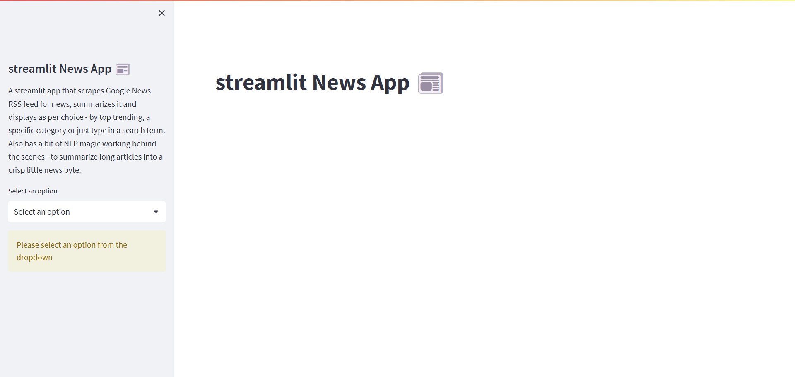
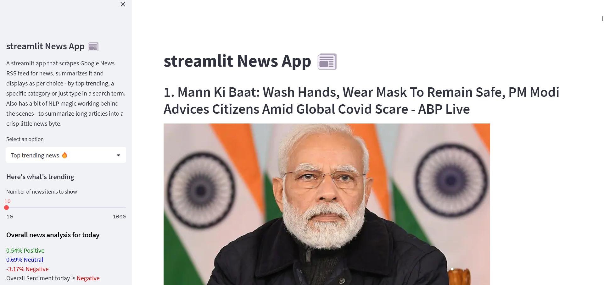
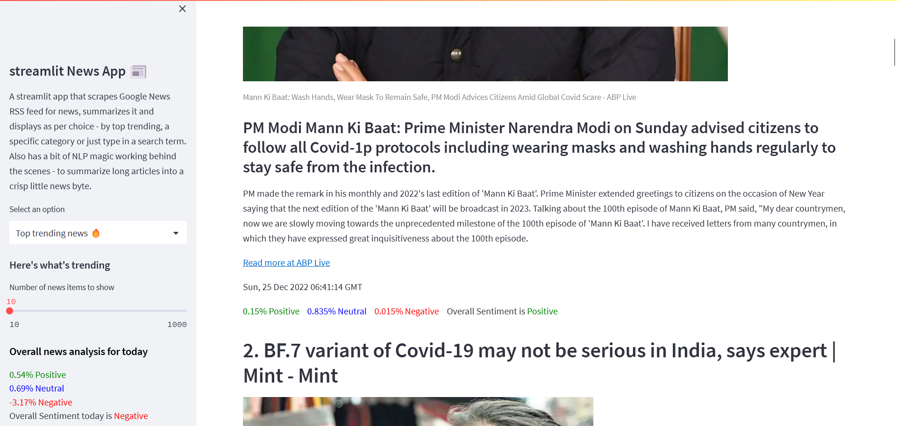
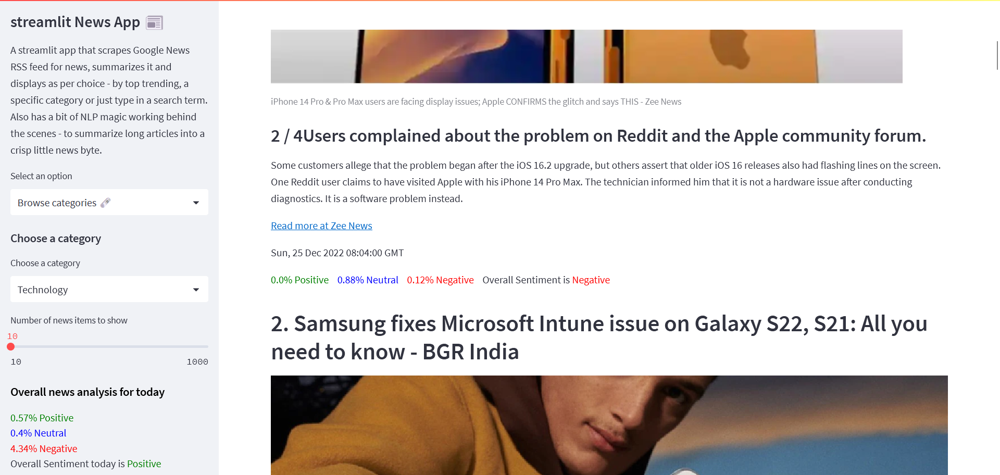
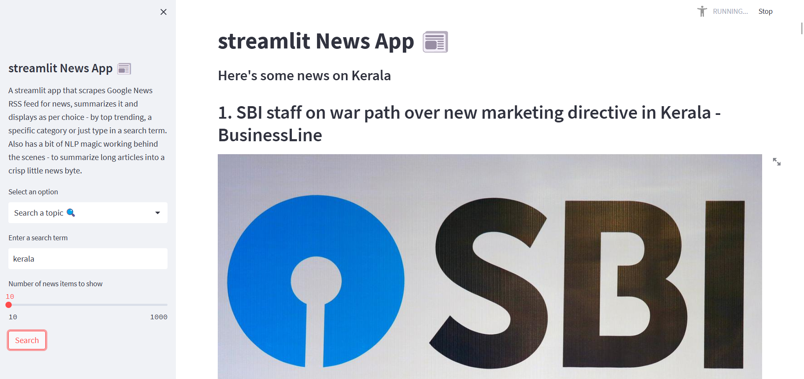
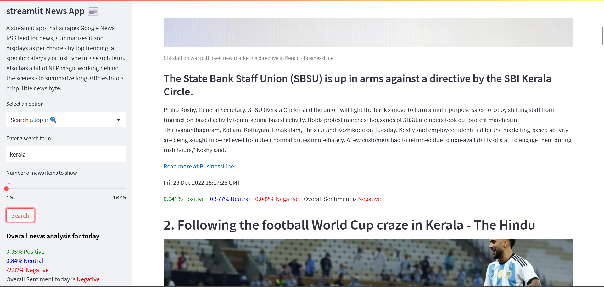

# streamlit News App 📰
A streamlit app that scrapes Google News RSS feed for news, summarizes it and displays as per choice - by top trending, category or as per a search term. Also has a bit of NLP magic working behind the scenes - to summarize long articles into a crisp little news byte.

# Dependencies
## Required dependencies
* streamlit (*web interface*)
* nltk (*natural language toolkit for analysing data*)
* newspaper3k (*analysing news articles*)
* bs4 (*for webscraping*)

## Optional dependencies
* black (*for formatting*)
  
## nltk packages required
* punkt (*for parsing & natural language processing*)
* vader_lexicon (*for sentiment analysis*)
  
# Steps
1. Create a virtual environment ```virtualenv .streamlit-news-app``` and activate it.
2. ```pip install -r requirements.txt``` to install required libraries.
3. Run the app ```streamlit run streamlit-news-app.py ```

# Screenshots
### Landing page

### Trending news page


### Category page


### Search page



